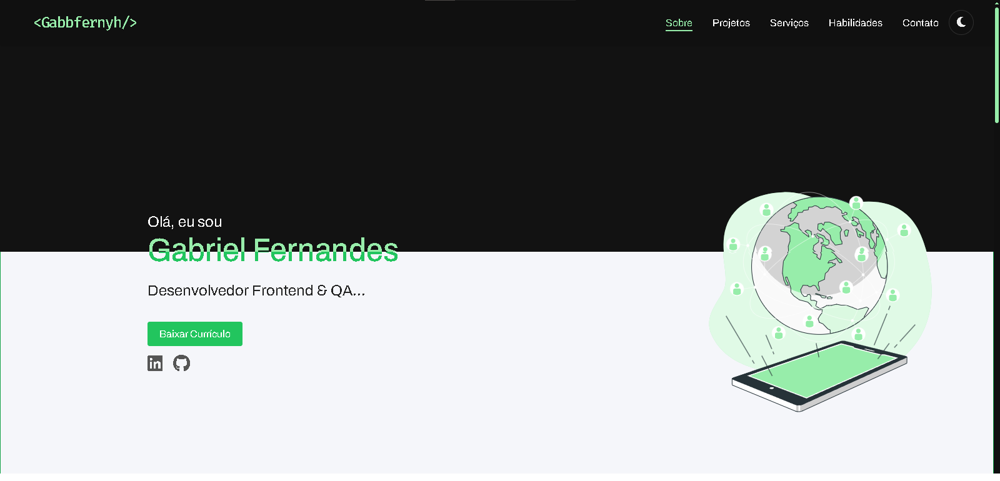

# Mefolio - Portfólio de Gabriel Fernandes

[](https://gabbfernyh.github.io/Mefolio/)



---

## 🚀 Sobre o Projeto

Este é o código-fonte do meu portfólio pessoal, "Mefolio". Ele foi criado para apresentar meus projetos, habilidades e informações de contato de uma forma moderna, animada e totalmente responsiva.

O site está disponível em: **[https://gabbfernyh.github.io/Mefolio/](https://gabbfernyh.github.io/Mefolio/)**

## ✨ Recursos

- **Tema Claro e Escuro:** Alternância de tema para preferência do usuário, com persistência no `localStorage`.
- **Design Responsivo:** Totalmente adaptado para uma ótima experiência em desktops, tablets e celulares.
- **Animações Sutis:** Efeitos de revelação ao rolar a página, implementados com a biblioteca ScrollReveal.js.
- **Carrossel Infinito:** O carrossel de serviços na versão mobile possui um loop infinito e suave.
- **Preloader de Página:** Uma tela de carregamento é exibida enquanto os recursos do site são carregados.
- **Formulário de Contato Funcional:** Integrado com o [Formspree](https://formspree.io/) para recebimento de mensagens via e-mail.
- **Otimizado para SEO:** Boas práticas de SEO, incluindo meta tags, links canônicos e atributos de imagem.

## 🛠️ Tecnologias Utilizadas

- **HTML5:** Estrutura semântica e moderna.
- **CSS3:** Estilização customizada com variáveis, Flexbox e Grid Layout.
- **JavaScript (ES6+):** Interatividade, manipulação do DOM e lógica dos componentes.
- **ScrollReveal.js:** Para as animações de scroll.

## 🏁 Como Executar Localmente

Este é um projeto frontend estático. Para executá-lo, siga os passos:

1. Clone o repositório:

   ```sh
   git clone https://github.com/Gabbfernyh/Mefolio.git
   ```

2. Navegue até o diretório do projeto:

   ```sh
   cd Mefolio
   ```

3. Abra o arquivo `index.html` diretamente no seu navegador de preferência.

E pronto! O site estará rodando localmente.

## 🚀 Deploy no GitHub Pages

Para fazer o deploy deste projeto no GitHub Pages, siga os passos:

1. Vá para a aba **"Settings"** do seu repositório no GitHub.
2. No menu lateral, clique em **"Pages"**.
3. Na seção "Build and deployment", em "Source", selecione **"Deploy from a branch"**.
4. Selecione a branch `main` (ou `master`) e a pasta `/(root)`.
5. Clique em **"Save"**. O GitHub irá iniciar o processo de deploy e fornecer o link do site.

## 📄 Licença

Distribuído sob a licença MIT.

---
