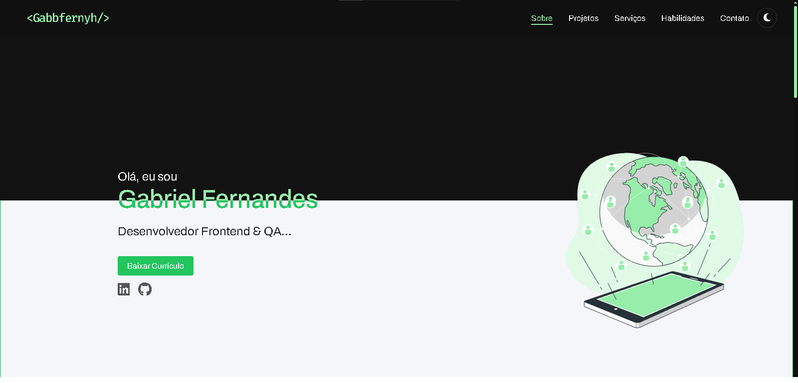

# Mefolio - Portfólio de Gabriel Fernandes

---

## 🚀 Sobre o Projeto

Este é o código-fonte do meu portfólio pessoal, "Mefolio". Ele foi criado para apresentar meus projetos, habilidades e informações de contato de uma forma moderna, animada e totalmente responsiva.

O site está disponível em: **[https://gabbfernyh.vercel.app](https://gabbfernyh.vercel.app)**

## ✨ Recursos

- **Tema Claro e Escuro:** Alternância de tema para preferência do usuário, com persistência no `localStorage`.
- **Design Responsivo:** Totalmente adaptado para uma ótima experiência em desktops, tablets e celulares.
- **Animações Sutis:** Efeitos de revelação ao rolar a página, implementados com a biblioteca ScrollReveal.js.
- **Carrossel Infinito:** O carrossel de serviços na versão mobile possui um loop infinito e suave.
- **Preloader de Página:** Uma tela de carregamento é exibida enquanto os recursos do site são carregados.
- **Formulário de Contato Funcional:** Integrado com o [Formspree](https://formspree.io/) para recebimento de mensagens via e-mail.
- **Otimizado para SEO:** Boas práticas de SEO, incluindo meta tags, links canônicos e atributos de imagem.

## 🛠️ Tecnologias Utilizadas

- **HTML5:** Estrutura semântica e moderna.
- **CSS3:** Estilização customizada com variáveis, Flexbox e Grid Layout.
- **JavaScript (ES6+):** Interatividade, manipulação do DOM e lógica dos componentes.
- **ScrollReveal.js:** Para as animações de scroll.

## 📄 Licença

Distribuído sob a licença MIT.

---
